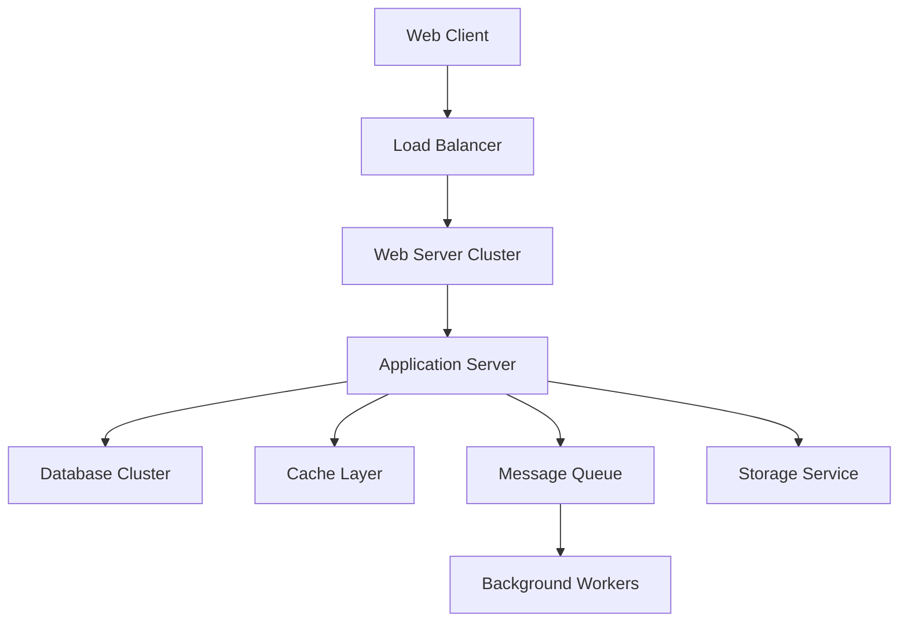
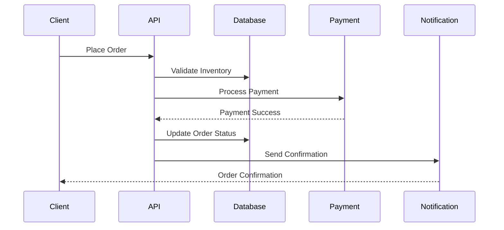
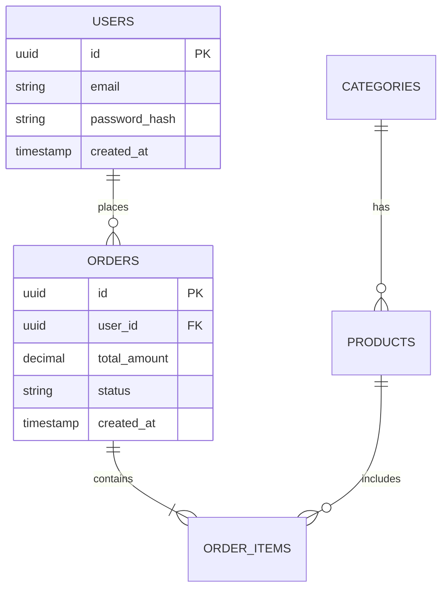
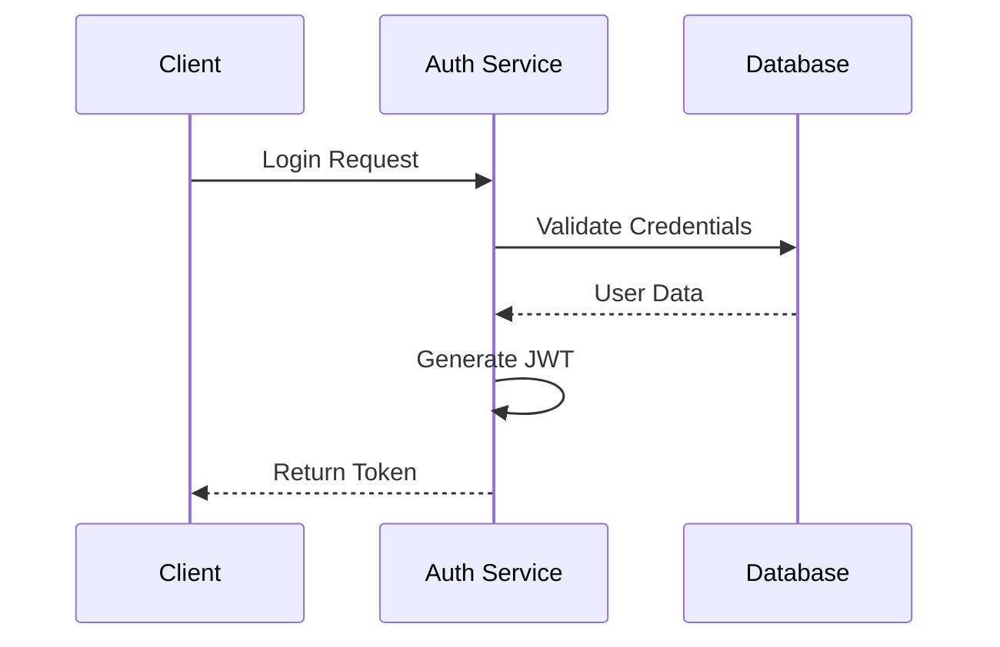

# TECHNICAL USER MANUAL
Version 1.0

## Document Control
| Document Information | |
|---------------------|---|
| Document Title | E-Commerce Platform Technical Manual |
| Version | 1.0 |
| Last Updated | 2024-11-04 |
| Author | Technical Team |
| Reviewer | Senior System Architect |
| Status | Final |

## Revision History
| Version | Date | Author | Description of Changes |
|---------|------|--------|----------------------|
| 0.1 | 2024-10-15 | John Doe | Initial Draft |
| 0.2 | 2024-10-20 | Jane Smith | Added API Documentation |
| 1.0 | 2024-11-04 | John Doe | Final Review & Release |

## Table of Contents
[Previous table of contents remains the same]

## 1. Introduction
### 1.1 Purpose
This technical manual provides comprehensive documentation for the E-Commerce Platform system. It serves as the primary reference for system administrators, developers, and technical support staff responsible for deploying, maintaining, and troubleshooting the system.

### 1.2 Scope
This manual covers:
- Core E-Commerce Platform
- Payment Gateway Integration
- Inventory Management System
- Customer Management System
- Analytics Module

### 1.3 Definitions and Acronyms
| Term | Definition |
|------|------------|
| API | Application Programming Interface |
| JWT | JSON Web Token |
| OMS | Order Management System |
| PGW | Payment Gateway |
| CMS | Customer Management System |
| IMS | Inventory Management System |

## 2. System Architecture
### 2.1 High-Level Architecture


Components:
- Frontend: React.js v18.2
- Backend: Node.js v18.x
- Database: PostgreSQL 14
- Cache: Redis 6.2
- Message Queue: RabbitMQ
- Storage: AWS S3

### 2.2 Component Interactions
Example sequence for order processing:


## 3. Technical Requirements
### 3.1 Hardware Requirements
| Component | Minimum | Recommended | Notes |
|-----------|---------|-------------|--------|
| CPU | 4 cores | 8 cores | Intel Xeon or AMD EPYC |
| RAM | 8GB | 16GB | DDR4 or better |
| Storage | 100GB SSD | 500GB SSD | NVMe preferred |
| Network | 100Mbps | 1Gbps | Low latency required |

### 3.2 Software Requirements
| Software | Version | Purpose | Installation Notes |
|----------|---------|---------|-------------------|
| Ubuntu Server | 20.04 LTS | Operating System | Minimal installation |
| Node.js | 18.x | Application Runtime | Use nvm for installation |
| PostgreSQL | 14.x | Primary Database | Enable WAL logging |
| Redis | 6.2 | Caching | Configure maxmemory |
| Nginx | 1.18+ | Web Server/Proxy | With HTTP/2 support |

## 4. Installation and Setup
### 4.1 Prerequisites Installation
```bash
# Update system
sudo apt update && sudo apt upgrade -y

# Install Node.js
curl -o- https://raw.githubusercontent.com/nvm-sh/nvm/v0.39.0/install.sh | bash
nvm install 18
nvm use 18

# Install PostgreSQL
sudo apt install postgresql postgresql-contrib -y

# Install Redis
sudo apt install redis-server -y
```

### 4.2 Application Setup
```bash
# Clone repository
git clone https://github.com/company/ecommerce-platform.git
cd ecommerce-platform

# Install dependencies
npm install

# Setup environment
cp .env.example .env
vim .env

# Database setup
npm run migrate
npm run seed
```

### 4.3 Configuration Files
```yaml
# app-config.yml
server:
  port: 3000
  host: '0.0.0.0'
  
database:
  host: 'localhost'
  port: 5432
  name: 'ecommerce_db'
  
redis:
  host: 'localhost'
  port: 6379
  
queue:
  host: 'localhost'
  port: 5672
```

## 5. Database Structure
### 5.1 Schema Diagram


### 5.2 Key Tables
#### Users Table
```sql
CREATE TABLE users (
    id UUID PRIMARY KEY DEFAULT gen_random_uuid(),
    email VARCHAR(255) UNIQUE NOT NULL,
    password_hash VARCHAR(255) NOT NULL,
    full_name VARCHAR(255),
    created_at TIMESTAMP WITH TIME ZONE DEFAULT CURRENT_TIMESTAMP,
    updated_at TIMESTAMP WITH TIME ZONE DEFAULT CURRENT_TIMESTAMP
);

-- Indexes
CREATE INDEX idx_users_email ON users(email);
```

## 6. API Documentation
### 6.1 Authentication
```javascript
// Example JWT Token Structure
{
  "header": {
    "alg": "RS256",
    "typ": "JWT"
  },
  "payload": {
    "sub": "1234567890",
    "name": "John Doe",
    "role": "admin",
    "iat": 1516239022
  }
}
```

### 6.2 API Endpoints
#### User Authentication
```http
POST /api/v1/auth/login
Content-Type: application/json

{
    "email": "user@example.com",
    "password": "securepassword"
}
```

Response:
```json
{
    "status": "success",
    "data": {
        "token": "eyJhbGciOiJIUzI1NiIs...",
        "user": {
            "id": "uuid",
            "email": "user@example.com",
            "role": "user"
        }
    }
}
```

## 7. Error Handling
### 7.1 Error Codes
| Code | Name | Description | Example Resolution |
|------|------|-------------|-------------------|
| E1001 | DB_CONNECTION_ERROR | Database connection failed | Check DB credentials and network |
| E1002 | AUTH_TOKEN_INVALID | Invalid authentication token | Request new token or re-login |
| E1003 | RATE_LIMIT_EXCEEDED | Too many requests | Implement backoff strategy |

### 7.2 Example Error Response
```json
{
    "status": "error",
    "error": {
        "code": "E1001",
        "message": "Database connection failed",
        "details": "Could not connect to PostgreSQL at localhost:5432",
        "timestamp": "2024-11-04T10:00:00Z"
    }
}
```

## 8. Monitoring and Logging
### 8.1 Logging Configuration
```javascript
// Winston Logger Configuration
const logger = winston.createLogger({
  level: 'info',
  format: winston.format.combine(
    winston.format.timestamp(),
    winston.format.json()
  ),
  transports: [
    new winston.transports.File({ filename: 'error.log', level: 'error' }),
    new winston.transports.File({ filename: 'combined.log' })
  ]
});
```

### 8.2 Monitoring Metrics
```javascript
// Prometheus Metrics Example
const httpRequestDuration = new prometheus.Histogram({
    name: 'http_request_duration_seconds',
    help: 'Duration of HTTP requests in seconds',
    labelNames: ['method', 'route', 'status_code'],
    buckets: [0.1, 0.5, 1, 2, 5]
});
```

## 9. Security
### 9.1 Security Configurations
```nginx
# Nginx Security Headers
server {
    # HTTPS configuration
    listen 443 ssl http2;
    ssl_protocols TLSv1.2 TLSv1.3;
    
    # Security headers
    add_header Strict-Transport-Security "max-age=31536000" always;
    add_header X-Frame-Options "SAMEORIGIN";
    add_header X-XSS-Protection "1; mode=block";
    add_header X-Content-Type-Options "nosniff";
}
```

### 9.2 Authentication Flow


## 10. Deployment
### 10.1 Docker Configuration
```dockerfile
# Dockerfile
FROM node:18-alpine

WORKDIR /app

COPY package*.json ./
RUN npm install --production

COPY . .

EXPOSE 3000
CMD ["npm", "start"]
```

```yaml
# docker-compose.yml
version: '3.8'
services:
  app:
    build: .
    ports:
      - "3000:3000"
    environment:
      - NODE_ENV=production
      - DB_HOST=postgres
    depends_on:
      - postgres
      - redis

  postgres:
    image: postgres:14
    environment:
      POSTGRES_PASSWORD: secret
```

## 11. Troubleshooting Guide
### 11.1 Common Issues and Solutions
| Issue | Symptoms | Solution Steps |
|-------|----------|----------------|
| Memory Leak | Increasing RAM usage | 1. Check heap dumps<br>2. Analyze with Node.js profiler<br>3. Monitor garbage collection |
| Slow Queries | High response times | 1. Check query plans<br>2. Verify indexes<br>3. Enable query logging |
| Connection Issues | TimeoutError | 1. Check network settings<br>2. Verify credentials<br>3. Check firewall rules |

### 11.2 Diagnostic Commands
```bash
# Check system resources
htop
df -h
free -m

# Check logs
tail -f /var/log/nginx/error.log
journalctl -u myapp.service

# Database diagnostics
pg_top
psql -c "SELECT * FROM pg_stat_activity;"
```

## 12. Maintenance Procedures
### 12.1 Backup Procedures
```bash
#!/bin/bash
# Database backup script
DATE=$(date +%Y%m%d)
PGPASSWORD=$DB_PASSWORD pg_dump -h localhost -U postgres ecommerce > backup_$DATE.sql
aws s3 cp backup_$DATE.sql s3://backups/database/
```

### 12.2 Update Procedures
```bash
# System update checklist
1. Announce maintenance window
2. Create backup
3. Stop services
   systemctl stop myapp
4. Update application
   git pull origin master
   npm install
5. Run migrations
   npm run migrate
6. Start services
   systemctl start myapp
7. Verify system health
   curl http://localhost/health
```
## 13. System Integration
### 13.1 Third-party Integrations
#### 13.1.1 Payment Gateway Integration
```javascript
// Stripe Integration Example
const stripe = require('stripe')(process.env.STRIPE_SECRET_KEY);

const processPayment = async (orderData) => {
  try {
    const paymentIntent = await stripe.paymentIntents.create({
      amount: orderData.amount,
      currency: 'usd',
      payment_method_types: ['card'],
      metadata: {
        orderId: orderData.orderId,
        customerId: orderData.customerId
      }
    });
    return paymentIntent;
  } catch (error) {
    logger.error('Payment processing failed:', error);
    throw new PaymentProcessingError(error.message);
  }
};
```

#### 13.1.2 Email Service Integration
```javascript
// SendGrid Integration
const sgMail = require('@sendgrid/mail');
sgMail.setApiKey(process.env.SENDGRID_API_KEY);

const sendOrderConfirmation = async (orderDetails) => {
  const msg = {
    to: orderDetails.customerEmail,
    from: 'orders@company.com',
    templateId: 'd-xxxxxxxxxxxxx',
    dynamic_template_data: {
      orderId: orderDetails.orderId,
      orderItems: orderDetails.items,
      totalAmount: orderDetails.total
    }
  };
  
  try {
    await sgMail.send(msg);
    logger.info(`Order confirmation sent for order ${orderDetails.orderId}`);
  } catch (error) {
    logger.error('Email sending failed:', error);
    throw new EmailServiceError(error.message);
  }
};
```

### 13.2 API Integration Patterns
#### 13.2.1 Webhook Handler
```javascript
const handleWebhook = async (req, res) => {
  const sig = req.headers['stripe-signature'];
  
  try {
    const event = stripe.webhooks.constructEvent(
      req.body,
      sig,
      process.env.STRIPE_WEBHOOK_SECRET
    );
    
    switch (event.type) {
      case 'payment_intent.succeeded':
        await processSuccessfulPayment(event.data.object);
        break;
      case 'payment_intent.failed':
        await processFailedPayment(event.data.object);
        break;
      default:
        logger.info(`Unhandled event type ${event.type}`);
    }
    
    res.json({received: true});
  } catch (err) {
    res.status(400).send(`Webhook Error: ${err.message}`);
  }
};
```

## 14. Performance Optimization
### 14.1 Caching Strategies
#### 14.1.1 Redis Caching Implementation
```javascript
const redis = require('redis');
const { promisify } = require('util');

class CacheService {
  constructor() {
    this.client = redis.createClient({
      host: process.env.REDIS_HOST,
      port: process.env.REDIS_PORT,
      password: process.env.REDIS_PASSWORD
    });
    
    this.getAsync = promisify(this.client.get).bind(this.client);
    this.setAsync = promisify(this.client.set).bind(this.client);
  }
  
  async getCachedData(key) {
    try {
      const cachedData = await this.getAsync(key);
      if (cachedData) {
        return JSON.parse(cachedData);
      }
      return null;
    } catch (error) {
      logger.error('Cache retrieval failed:', error);
      return null;
    }
  }
  
  async setCachedData(key, data, expiry = 3600) {
    try {
      await this.setAsync(key, JSON.stringify(data), 'EX', expiry);
    } catch (error) {
      logger.error('Cache setting failed:', error);
    }
  }
}
```

### 14.2 Database Optimization
#### 14.2.1 Index Optimization
```sql
-- Performance-oriented indexes
CREATE INDEX idx_orders_user_status ON orders(user_id, status);
CREATE INDEX idx_products_category_status ON products(category_id, status) WHERE status = 'active';
CREATE INDEX idx_order_items_order_product ON order_items(order_id, product_id);

-- Partial indexes for common queries
CREATE INDEX idx_active_products ON products(id) 
WHERE status = 'active' AND inventory_count > 0;

-- Full-text search indexes
CREATE INDEX idx_products_search ON products 
USING gin(to_tsvector('english', name || ' ' || description));
```

#### 14.2.2 Query Optimization Examples
```sql
-- Before optimization
SELECT p.* FROM products p 
WHERE category_id = 1 AND status = 'active';

-- After optimization (with materialized view)
CREATE MATERIALIZED VIEW active_products AS
SELECT p.* FROM products p 
WHERE status = 'active'
WITH DATA;

CREATE UNIQUE INDEX ON active_products(id);

-- Refresh strategy
REFRESH MATERIALIZED VIEW CONCURRENTLY active_products;
```

## 15. Testing Strategies
### 15.1 Unit Testing
```javascript
// Jest Test Example
describe('Order Service', () => {
  let orderService;
  
  beforeEach(() => {
    orderService = new OrderService();
  });
  
  test('should calculate correct order total', () => {
    const items = [
      { price: 10, quantity: 2 },
      { price: 15, quantity: 1 }
    ];
    
    const total = orderService.calculateTotal(items);
    expect(total).toBe(35);
  });
  
  test('should throw error for invalid items', () => {
    const items = null;
    expect(() => {
      orderService.calculateTotal(items);
    }).toThrow('Invalid items provided');
  });
});
```

### 15.2 Integration Testing
```javascript
// Supertest API Testing
describe('Order API', () => {
  beforeEach(async () => {
    await setupTestDatabase();
  });
  
  it('should create new order', async () => {
    const response = await request(app)
      .post('/api/orders')
      .set('Authorization', `Bearer ${testToken}`)
      .send({
        items: [
          { productId: 1, quantity: 2 }
        ]
      });
      
    expect(response.status).toBe(201);
    expect(response.body).toHaveProperty('orderId');
  });
});
```

### 15.3 Load Testing
```javascript
// k6 Load Test Script
import http from 'k6/http';
import { check, sleep } from 'k6';

export const options = {
  stages: [
    { duration: '30s', target: 20 },
    { duration: '1m30s', target: 10 },
    { duration: '20s', target: 0 },
  ],
};

export default function() {
  const res = http.get('http://test.k6.io');
  check(res, {
    'status was 200': (r) => r.status == 200,
    'transaction time OK': (r) => r.timings.duration < 200,
  });
  sleep(1);
}
```

## 16. Deployment Strategies
### 16.1 CI/CD Pipeline
```yaml
# GitHub Actions workflow
name: CI/CD Pipeline

on:
  push:
    branches: [ master ]
  pull_request:
    branches: [ master ]

jobs:
  build:
    runs-on: ubuntu-latest
    
    steps:
    - uses: actions/checkout@v2
    
    - name: Setup Node.js
      uses: actions/setup-node@v1
      with:
        node-version: '18.x'
    
    - name: Install dependencies
      run: npm ci
    
    - name: Run tests
      run: npm test
    
    - name: Build
      run: npm run build
    
    - name: Deploy to staging
      if: github.ref == 'refs/heads/master'
      run: |
        echo "${{ secrets.KUBECONFIG }}" > kubeconfig
        kubectl --kubeconfig=kubeconfig apply -f k8s/
```

### 16.2 Kubernetes Deployment
```yaml
# deployment.yaml
apiVersion: apps/v1
kind: Deployment
metadata:
  name: ecommerce-api
spec:
  replicas: 3
  selector:
    matchLabels:
      app: ecommerce-api
  template:
    metadata:
      labels:
        app: ecommerce-api
    spec:
      containers:
      - name: api
        image: company/ecommerce-api:latest
        ports:
        - containerPort: 3000
        env:
        - name: NODE_ENV
          value: "production"
        - name: DB_HOST
          valueFrom:
            configMapKeyRef:
              name: app-config
              key: db_host
        resources:
          requests:
            memory: "256Mi"
            cpu: "200m"
          limits:
            memory: "512Mi"
            cpu: "500m"
```

## 17. System Scaling
### 17.1 Horizontal Scaling
```yaml
# HPA Configuration
apiVersion: autoscaling/v2
kind: HorizontalPodAutoscaler
metadata:
  name: api-hpa
spec:
  scaleTargetRef:
    apiVersion: apps/v1
    kind: Deployment
    name: ecommerce-api
  minReplicas: 3
  maxReplicas: 10
  metrics:
  - type: Resource
    resource:
      name: cpu
      target:
        type: Utilization
        averageUtilization: 70
```

### 17.2 Database Scaling
```sql
-- Partitioning Example
CREATE TABLE orders_partition (
    id UUID,
    user_id UUID,
    created_at TIMESTAMP,
    status VARCHAR(50)
) PARTITION BY RANGE (created_at);

-- Create partitions
CREATE TABLE orders_2024_q1 PARTITION OF orders_partition
    FOR VALUES FROM ('2024-01-01') TO ('2024-04-01');
    
CREATE TABLE orders_2024_q2 PARTITION OF orders_partition
    FOR VALUES FROM ('2024-04-01') TO ('2024-07-01');
```

## 18. Disaster Recovery
### 18.1 Backup Strategy
```bash
#!/bin/bash
# Comprehensive backup script

# Variables
BACKUP_DIR="/backup"
DB_NAME="ecommerce"
S3_BUCKET="s3://company-backups"

# Database backup
pg_dump $DB_NAME > $BACKUP_DIR/db_backup_$(date +%Y%m%d).sql

# Application files backup
tar -czf $BACKUP_DIR/app_backup_$(date +%Y%m%d).tar.gz /app/

# Upload to S3
aws s3 sync $BACKUP_DIR $S3_BUCKET/$(date +%Y%m%d)/

# Cleanup old backups
find $BACKUP_DIR -type f -mtime +7 -delete
```

### 18.2 Recovery Plan
```bash
#!/bin/bash
# Recovery script

# Variables
BACKUP_DATE=$1
BACKUP_DIR="/backup"
DB_NAME="ecommerce"

# Download backup from S3
aws s3 sync $S3_BUCKET/$BACKUP_DATE $BACKUP_DIR/

# Restore database
psql $DB_NAME < $BACKUP_DIR/db_backup_$BACKUP_DATE.sql

# Restore application files
tar -xzf $BACKUP_DIR/app_backup_$BACKUP_DATE.tar.gz -C /app/

# Restart services
systemctl restart nginx
systemctl restart app
```

## 19. Security Best Practices
### 19.1 Security Headers
```javascript
// Security middleware
const helmet = require('helmet');
app.use(helmet());

app.use((req, res, next) => {
  res.setHeader('Content-Security-Policy', "default-src 'self'");
  res.setHeader('X-Content-Type-Options', 'nosniff');
  res.setHeader('X-Frame-Options', 'DENY');
  res.setHeader('Strict-Transport-Security', 'max-age=31536000; includeSubDomains');
  next();
});
```

### 19.2 Rate Limiting
```javascript
const rateLimit = require('express-rate-limit');

const apiLimiter = rateLimit({
  windowMs: 15 * 60 * 1000, // 15 minutes
  max: 100, // limit each IP to 100 requests per windowMs
  message: {
    status: 'error',
    message: 'Too many requests, please try again later.'
  }
});

app.use('/api/', apiLimiter);
```

## 20. Development Guidelines
### 20.1 Code Style Guide
```javascript
// ESLint Configuration
module.exports = {
  extends: [
    'eslint:recommended',
    'plugin:@typescript-eslint/recommended'
  ],
  rules: {
    'indent': ['error', 2],
    'quotes': ['error', 'single'],
    'semi': ['error', 'always'],
    'no-unused-vars': 'error',
    'max-len': ['error', { code: 80 }]
  }
};
```

### 20.2 Git Workflow
```bash
# Git workflow commands
# Feature development
git checkout -b feature/new-feature
git add .
git commit -m "feat: add new feature"
git push origin feature/new-feature

# Code review process
# 1. Create Pull Request
# 2. Review & approve
# 3. Merge to development

# Release process
git checkout master
git merge development
git tag -a v1.2.3 -m "Release version 1.2.3"
git push origin master --tags
```

### Support Contacts
- 

### Reference Documents
